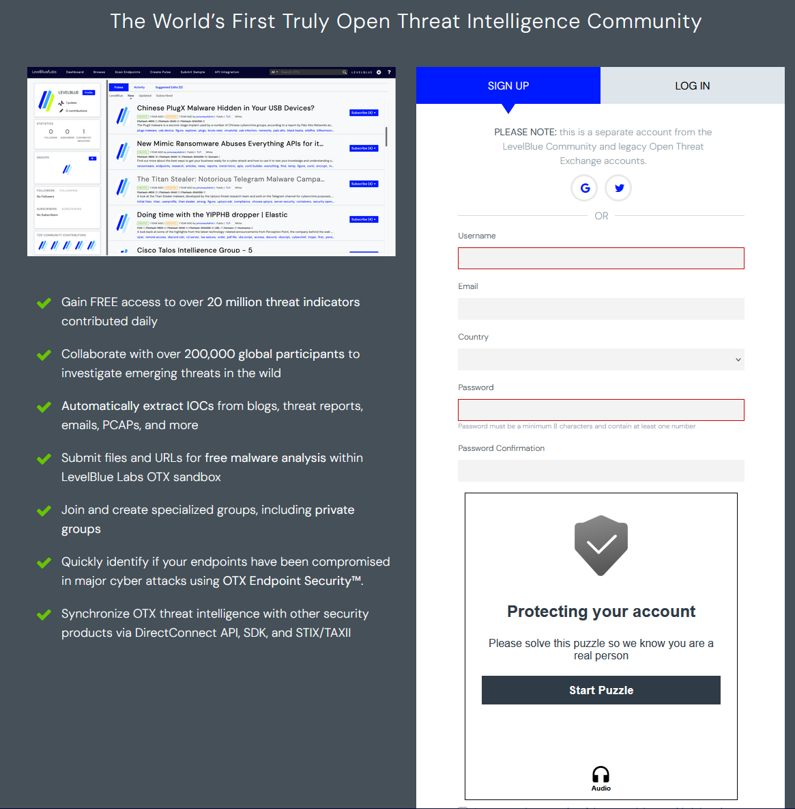
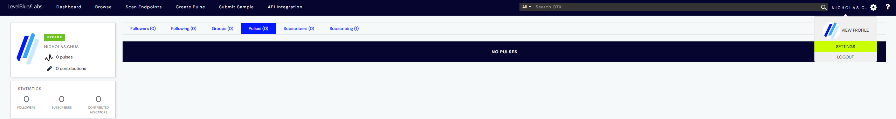
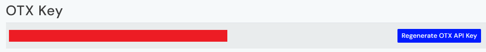
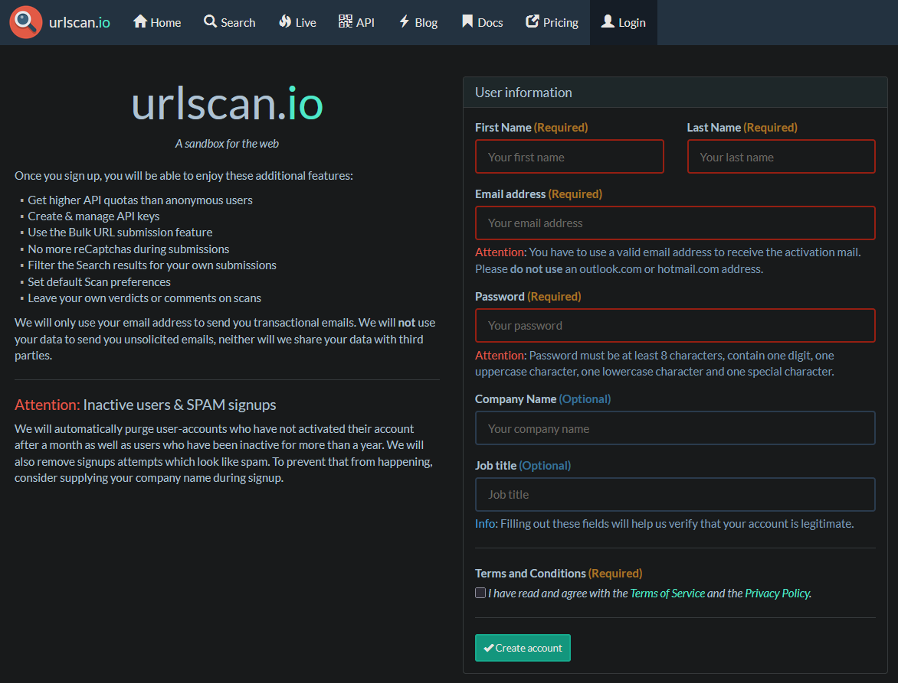
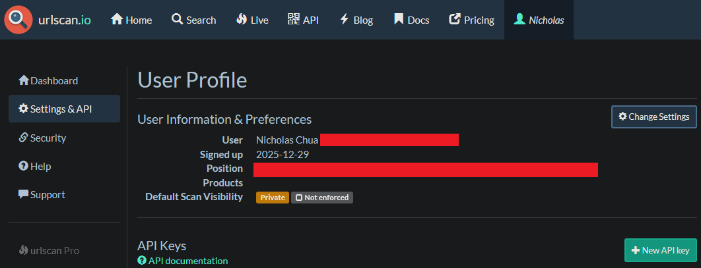
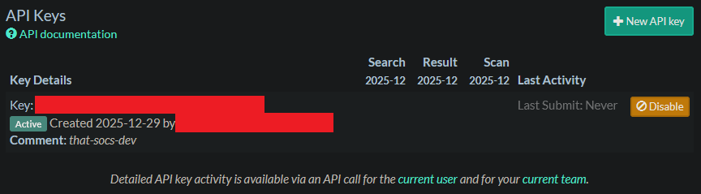
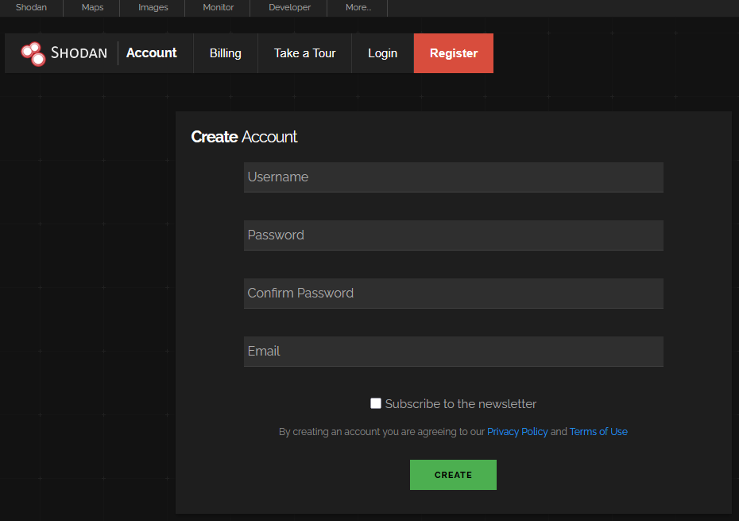
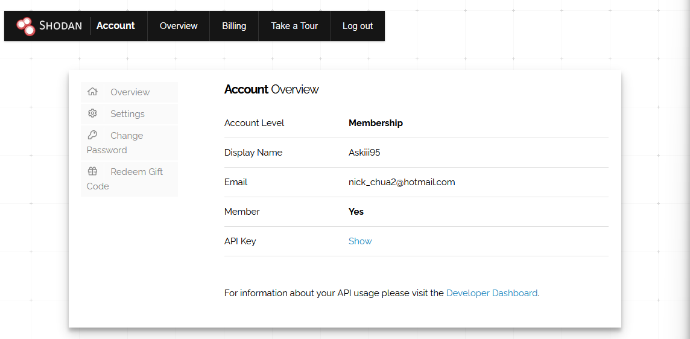
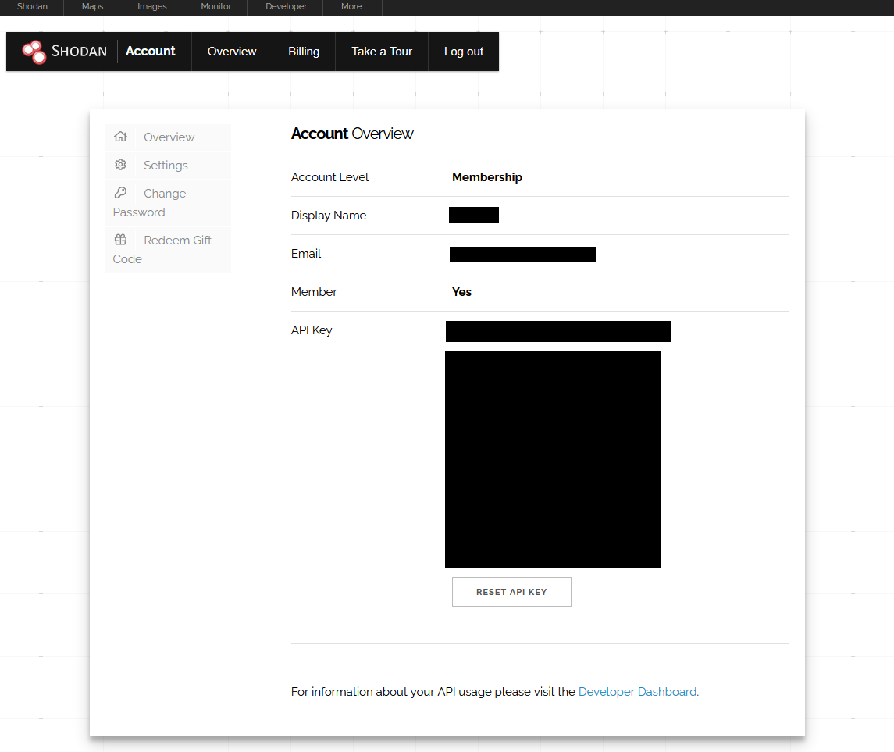

# That SOCs

Spiritual successor to my old project [siem_osint_automation](https://github.com/NicholasChua/siem_osint_automation) enhanced with more modularity, logging, and better coding practices.

## Planned Workflow

`That SOCs` currently covers the `Logging`, `IOC Extraction`, `Threat Intelligence Retrieval`, `Normalization`, `Enrichment` stages of the below planned workflow:

- **Alert Retrieval**: Fetches open (unassigned) security alerts from specified sources.
- **IOC Extraction**: Extracts Indicators of Compromise (IOCs) from the alerts.
- **Threat Intelligence Retrieval**: Queries threat intelligence sources for information related to the extracted IOCs.
- **Normalization**: Standardizes the retrieved threat intelligence data into a consistent format.
- **Enrichment**: Augments the original alerts with the normalized threat intelligence data.
- **Alert Update**: Updates the status of the alerts based on the investigation results.
- **Logging**: Logs all activities for auditing and debugging purposes.

## Requirements

This project was tested on Python 3.14.2.

- Python 3 (latest version recommended)
- VirusTotal API key (free tier is sufficient)
- ipinfo.io API key (free tier is sufficient)
- AbuseIPDB API key (free tier is sufficient)
- AlienVault OTX API key (free tier is sufficient)
- URLScan.io API key (free tier is sufficient)
- Shodan API key (free tier is sufficient)
- .env file containing API keys

## How to Get API Keys

### VirusTotal

1. Register for a free VirusTotal account: [https://www.virustotal.com/gui/join-us](https://www.virustotal.com/gui/join-us).


2. Once logged in, click on the top-right corner where your profile icon is and select "API Key". This will direct you to the [API Key page](https://www.virustotal.com/gui/my-apikey).


3. Under API Key, click on "Copy to clipboard" to copy your API key


### ipinfo.io

1. Register for a free IPinfo account: [https://ipinfo.io/signup](https://ipinfo.io/signup).


2. Once logged in and on the [home page](https://ipinfo.io/account/home), scroll down to `Step 3: Get your token`, and click on `Copy` to copy your API key.


### AbuseIPDB

1. Register for a free AbuseIPDB account: [https://www.abuseipdb.com/register?plan=free](https://www.abuseipdb.com/register?plan=free).


2. After registering, log in to your account and navigate to the [API Key page](https://www.abuseipdb.com/account/api). You can create a new API key by clicking on the `Create Key` button under the `Keys` section.


3. Give the key a name, then click on `Create` and the `Copy to Clipboard` button to copy your API key.


### AlienVault OTX

1. Register for a free AlienVault OTX account: [https://otx.alienvault.com/#signup](https://otx.alienvault.com/#signup).



2. Once registered and logged in, navigate to your profile by clicking on your username in the top-right corner and selecting `Settings`.



3. Scroll down to the `API Key` tab to view your API key.



### URLScan.io

1. Register for a free URLScan.io account: [https://urlscan.io/user/signup/](https://urlscan.io/user/signup/).



2. After registering and logging in, navigate to your profile by clicking on your username in the top-right corner. Click on `Settings & API` on the left. Click on `New API Key` to generate a new API key.



3. Give your API key a name, then click on `Create API Key`. Returning to the profile, you can now copy your API key.



### Shodan

1. Register for a free Shodan account: [https://account.shodan.io/register](https://account.shodan.io/register).



2. After registering and logging in, navigate to the [Account Page](https://account.shodan.io/) where your API key will be shown.



3. Click on the `Show` button and copy your API key.



### .env File Setup

**`Warning`**: Do not share, upload, commit, or otherwise expose your API keys to the public. This can lead to unauthorized access and usage of your API keys. The `.env` file is used to store your API keys in a secure manner, and has been added to the `.gitignore` file to prevent accidental exposure.

1. Copy the `.env.example` file and rename it to `.env`. It should be in the root directory of the project with the following format:

```text
VIRUSTOTAL_API_KEY=YOUR VIRUSTOTAL API KEY
IPINFO_API_KEY=YOUR IPINFO API KEY
ABUSEIPDB_API_KEY=YOUR ABUSEIPDB API KEY
ALIENVAULT_API_KEY=YOUR ALIENVAULT API KEY
URLSCAN_API_KEY=YOUR URLSCAN API KEY
SHODAN_API_KEY=YOUR SHODAN API KEY
```

2. Replace `YOUR VIRUSTOTAL API KEY`, `YOUR IPINFO API KEY`, `YOUR ABUSEIPDB API KEY`, `YOUR ALIENVAULT API KEY`, `URLSCAN_API_KEY`, `SHODAN_API_KEY` with the respective API keys you obtained in the previous steps.

3. Ensure that the `.env` file is in the root directory of the project.

## Quick Start

1. Install the required Python packages using pip:

```bash
pip install -r requirements.txt
```

2. Ensure your `.env` file is set up with the necessary API keys as described in [`.env File Setup`](#env-file-setup) section.

3. Run main.py to execute the example workflow with an IOC:

```bash
python main.py {ioc_type} {ioc_value}
# Example for an IP address IOC
python main.py ip 8.8.8.8
```

## Unit Tests

Unit tests are provided in the `tests/` directory. To run the tests, use the following command:

```bash
pytest tests/ -v
```

## To Do

- opentip.kasperky API integration
- filescan.io API integration
- API rate limit definitions and handling
